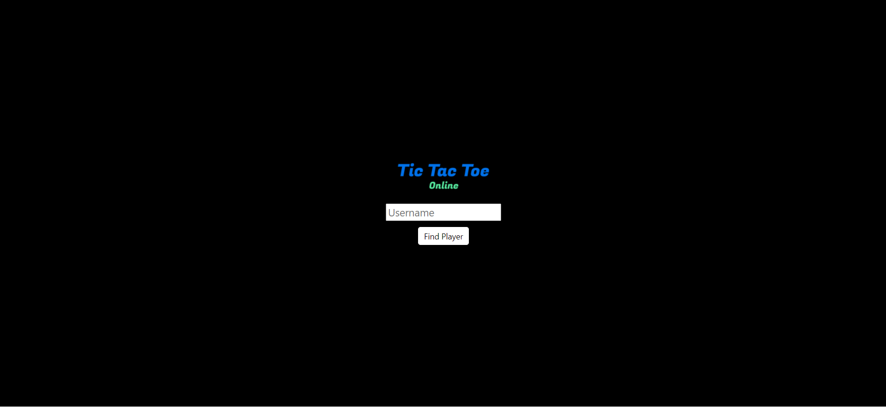

# Tictactoe Online

Tictactoe Online is a website where players across the internet can play a set of two-out-of-three game.

## Table of contents

- [Overview](#overview)
  - [Project](#project)
  - [Technologies](#technologies)
  - [Instructions to get project up and running](#instructions-to-get-project-up-and-running)
  - [Screenshot](#screenshot)
  - [Links](#links)
- [Author](#author)

## Overview

## Project
- This application uses socket.io library for realtime communcation, to enable users to player tictactoe in realtime.

## Technologies
- Node.js Express Socket.io 

### Instructions to get project up and running locally

1. Clone Repository
2. npm install
3. npm start

### Screenshot

### Links

- Live Site URL: [https://tictactoe-online-demo.herokuapp.com/]

## Author

- Github - [@csmurillo](https://github.com/csmurillo)

